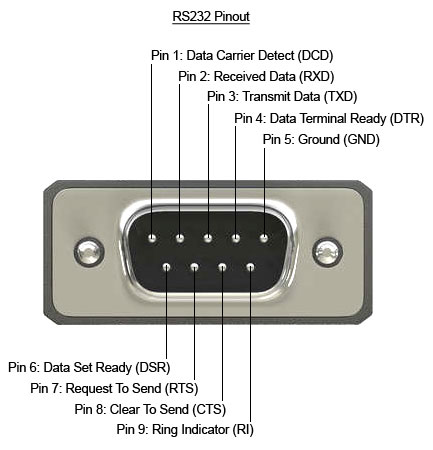

# red_camera

Software for isotecnic red camera control.

## Camera Connections supported 

- Version 0.1:
    - Wifi (via websockets library)
- Version 0.2:
    - Uart (via pyserial library)
- Version 0.3:
    - keyaction support

# Installation 

## Install the `red_camera` package

Be sure you have installed python's package manager

```
sudo apt install python3-pip
```
Then, clone and cd into this project and run 

```
git clone https://github.com/andreafranceschetti/red_camera.git
cd ~/red_camera
pip install .
```
or, in developer mode:

```
pip install -e .
```


## Install the `systemd` service

Copy the package's systemd service to `etc/systemd/system/red_camera.service`
```
sudo cp ~/red_camera/services/red_camera.service /etc/systemd/system/red_camera.service
```

Enable it (to make it start at boot) and start it:

```
sudo systemctl enable red_camera
sudo systemctl start red_camera
```

# Hardware setup

## Raspberry gpio pinout


## Wire the keypad to the raspberry

Wire the 8 wires of the keypad (4 rows, 4 columns) to the raspberry gpios according to the following schematic:

| Keypad Pin    | Raspberry Pin |
| -----------   | -----------   |
| R1            | GPIO 4        |
| R2            | GPIO 17       |
| R3            | GPIO 27       |
| R4            | GPIO 22       |
| C1            | GPIO 18       |
| C2            | GPIO 23       |
| C3            | GPIO 24       |
| C4            | GPIO 25       |


## Wire the raspberry to the camera

### Power
You should be able to power the raspberry with the 5V AUX of EXT connector via the micro usb port. 
This will require a micro-usb adapter, wiring the 5V and GND attached to the EXT 5V AUX and ground.

Otherwise, you may power the raspberry via the 5V pin n2 (second from top of the right column) and the GND pin right below.

| Camera EXT    | Raspberry            |
| -----------   | -----------               |
|5V             | micro-usb 5V / 5V n2 pin|
|GND            | micro-usb GND/ Ground pin |

### Communication

To communicate with the camera from the raspberry, we will use RCP2 API protocol, which relies on the integrated webserver built in the camera.
To avoid using wifi to communicate with the camera, we will use the camera uart serial interface provided by the EXT connector, using ppp protocol over seial. This emulates the network connection by means of serial communication with minimal overhead.

However, you will need a RS232 to TTL converter to connect the raspberry to your camera's EXT connector UART RX/TX. For the ground, any Ground pin should work just fine. 

> **Warning**: Be sure to power the TTL side of the converter with 3.3V (from the raspberrry 3.3V, for example)





| Camera EXT    | Converter (RS-232 side)   | Converter (TTL side) | Raspberry Pin           |
| -----------   | -----------               | -----------          |-----------              |
|-              | -                         | VCC (3.3V)           | 3.3V
| UART RX       | Pin2: Received Data (RXD) | RXD                  | GPIO 15 (UART TX)      |
| UART TX       | Pin3: Transmit Data (TXD) | TXD                  | GPIO 14 (UART RX)       |
| GND           | Pin5: Ground (GND)        | GND                  | Ground                 |


## Useful commands for the raspberry pi 

Hereby you can find a list of useful commands to test this package from raspberry.

### Select wifi network from cli with `wpa_cli`

```
wpa_cli -i wlan0 list_networks
```
Choose now your network number ID:

```
wpa_cli -i wlan0 select_network <ID>
```

You can find registered networks (with ssid and psw) in this text file:

```
/etc/wpa_supplicant/wpa_supplicant.conf
```

### Access raspberry pi via ssh

Access the raspberry pi zero w if connected to the same wifi network (password `raspberry`):
```
ssh pi@raspberrypi.local
```